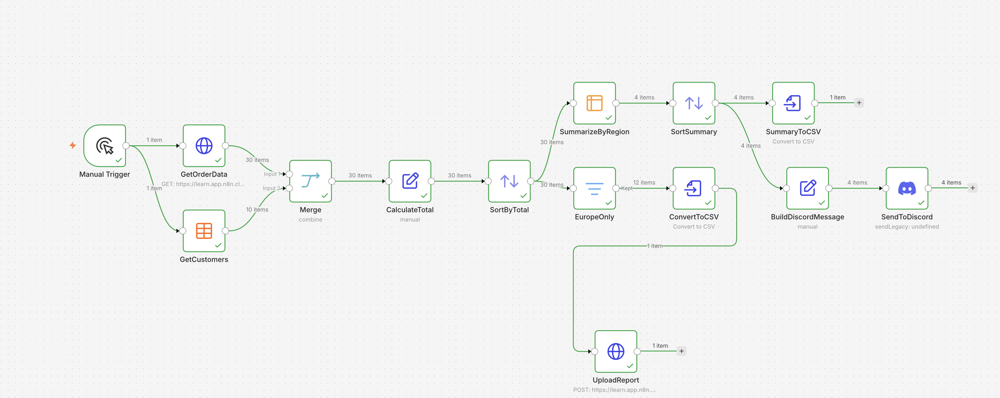
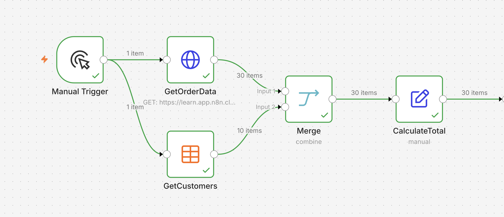
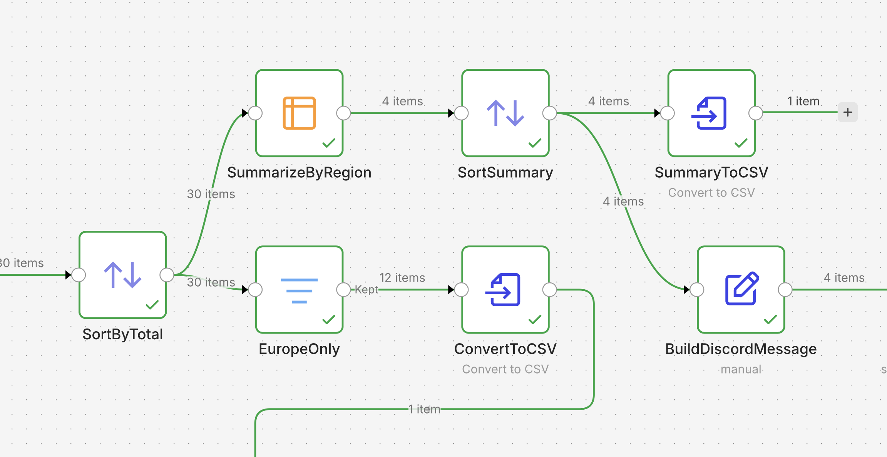
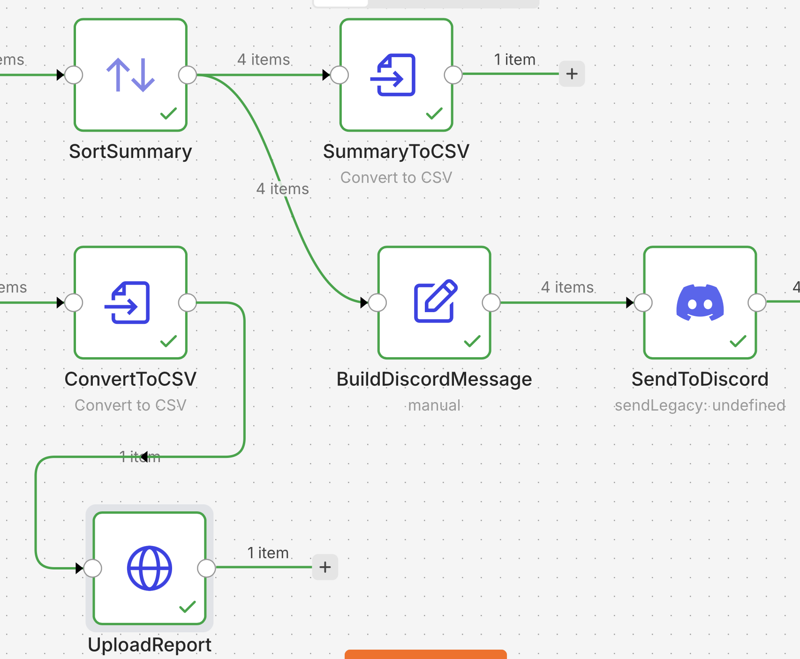

# n8n Automated Reporting Workflow

A portfolio project demonstrating an end-to-end automated reporting workflow built with n8n.

## Overview

This workflow retrieves order and customer data, merges multiple data sources, calculates order totals, creates regional summaries, generates CSV reports, sends reporting data to Discord, and uploads generated files to an external endpoint.

The project demonstrates how n8n can be used to automate a complete business reporting process from data retrieval to final report distribution.

## Workflow Overview



## What the Workflow Does

1. Retrieves order data from an API.
2. Retrieves customer data from a structured data source.
3. Merges order and customer information.
4. Calculates total order values.
5. Sorts and processes the transformed records.
6. Creates regional sales summaries.
7. Filters records for a specific business region.
8. Converts reporting data into CSV files.
9. Builds a structured Discord reporting message.
10. Sends the report summary to Discord.
11. Uploads the generated report to an external endpoint.

## Data Merge and Calculation



The workflow combines data from multiple sources before calculating the total value of each order.

This demonstrates:

- multi-source data processing
- data merging
- field transformation
- calculated fields
- reusable workflow branches

## Reporting and Analysis



The processed data is used in multiple reporting branches.

The workflow performs:

- sorting
- regional aggregation
- filtering
- summary calculations
- CSV generation
- report preparation

## Final Report Actions



The final workflow branches handle different report destinations:

- CSV report generation
- Discord reporting
- file upload to an external endpoint

## Key n8n Concepts Used

- HTTP Request
- Data Tables
- Merge
- Edit Fields
- Expressions
- Sorting
- Filtering
- Workflow branching
- Summarize
- Convert to File
- Binary data handling
- Discord integration
- API integration
- CSV generation

## Example Architecture

```text
Order API -----------\
                      \
                       Merge
                      /
Customer Data -------/

        |
        v
Calculate Order Total
        |
        v
Sort Data
        |
        +----------------------+
        |                      |
        v                      v
Regional Summary         Regional Filter
        |                      |
        v                      v
Sort Summary              Convert to CSV
        |                      |
        +----------+-----------+
                   |
          +--------+--------+
          |                 |
          v                 v
    CSV Summary       Discord Message
                            |
                            v
                      Send to Discord

Filtered CSV
     |
     v
Upload Report
```

## Repository Structure

```text
n8n-automated-reporting-workflow/
|
├── README.md
├── n8n-automated-reporting-workflow-public.json
|
└── screenshots/
    ├── workflow-overview.png
    ├── data-merge-and-calculation.png
    ├── reporting-and-analysis.png
    └── final-report-actions.png
```

## Workflow File

The repository includes a sanitized n8n workflow export:

n8n-automated-reporting-workflow-public.json

Sensitive credentials, internal identifiers, and environment-specific endpoints have been removed from the public version.

Placeholder API endpoints and configuration values are used where required.

## How to Use

1. Import n8n-automated-reporting-workflow-public.json into n8n.
2. Configure your API endpoints.
3. Configure your customer data source.
4. Add the required authentication credentials.
5. Configure Discord credentials if Discord notifications are required.
6. Replace placeholder endpoint values.
7. Execute the workflow.
   
## Skills Demonstrated

This project demonstrates practical experience with:

- workflow automation
- API integration
- data merging
- data transformation
- reporting automation
- conditional logic
- aggregation
- CSV generation
- binary file handling
- Discord notifications
- multi-branch workflow design
- structured business reporting
  
  ## Project Type
  
  Portfolio automation project demonstrating a complete reporting workflow built with n8n.
